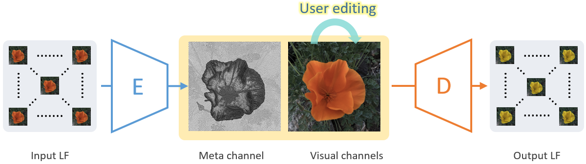

# LF2MV: Convert Light Field into An Editable Meta-View
<!-- ------------------------------------------------------------------------------ -->

**This is the official PyTorch implementation of [LF2MV: Learning An Editable Meta-View Towards Light Field Representation](https://arxiv.org/abs/2103.11314)**

We propose a light field representation learning framework that converts a 4D light field into a single meta-view. The learned meta-view representation enables light filed edits to be as simple as a 2D image operation, which is memory-efficient and supports most image processing algorithms (e.g. color transfer, style transfer, shadow removal, etc). **Check results in the [demo video](https://youtu.be/k6wP5TWr4Ro).**

<div align="center">
	
</div>


## Dependencies and Installation

#### create a anaconda env with required packages installed
```
conda env create -f lf2mvPT.yml
```

#### git clone this repository
```
git clone https://github.com/MenghanXia/LF2MV
cd LF2MV
```


## Quick Inference
- **Download Pre-trained Models**: download a pretrained model at [Google drive](https://drive.google.com/file/d/1yyaxz0Hl2OdadrwGhOmkmIlbD1OS_DnJ/view?usp=sharing) or run ```sh ./checkpts/weight_download.sh```, and put it into the folder `./checkpts`. *Currently, we only provided the model trained on light field with 7x7 views.*

- **Prepare Testing Data**: Put your light field samples into `./data/lightfield`. Optionally, put the *edited* central views into `./data/cview` accordingly, which are only required at edit mode.

- **Run the inference**: Run the script ```sh run_demo.sh``` and the results will be saved in `./result`. Also, you can specify your own directories by runing the command below:
```
python inference.py --config [configure file] --checkpt [checkpoint path] --input [data dir] \
--save [output dir]
```
Particularly, if you want the **reconstruction from edited visual channels** (aka central view), you need to put the edited visual channels into `./data/cview` (must be named the same as its light field) at first. Then, run the command with the argument `--edit` added:
```
python inference.py --config [configure file] --checkpt [checkpoint path] --input [data dir] \
--save [output dir] --edit
```

## Copyright and License
You are granted with the [LICENSE](./LICENSE) for both academic and commercial usages.


<!-- ------------------------------------------------------------------- -->
## Citation
If any part of our paper and code is helpful to your work, please generously cite our paper.