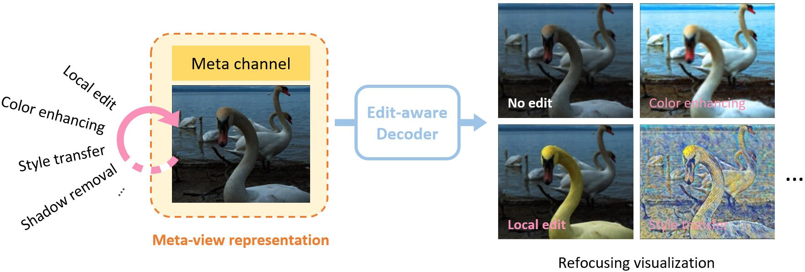

# LF2MV: Learning An Editable Meta-View Towards Light Field Representation
<!-- ------------------------------------------------------------------------------ -->

	

Our learned meta-view representation enables light filed edits to be as simple as a 2D image operation, which is memory-efficient and supports most image processing algorithms (e.g. color transfer, style transfer, shadow removal, etc). Due to its compactness, the process can be performed on lightweight mobile devices or via online cloud computation.

## *Code coming soon!*